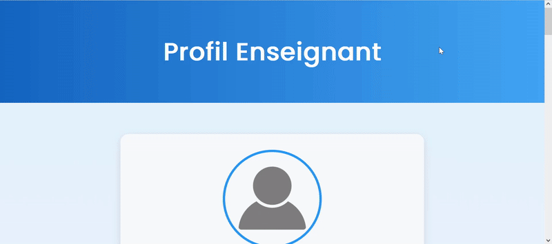

# TP3 Web

## 🎥 Résultat attendu

## Objectif du TP
Mettre en pratique les propriétés CSS vues en cours pour concevoir une **mini page web stylée, interactive et responsive**.  
Vous allez explorer les propriétés sur :
- Les couleurs et dégradés
- Les polices et bordures
- Le positionnement et la superposition
- Les pseudo-classes et transformations
- Le modèle Flexbox

---

### Exercice 1 : Profil Étudiant
Créer une page `index.html` liée à un fichier `style.css` présentant un **profil d’étudiant**.

**Contenu obligatoire :**
- Un en-tête `<header>` avec un titre.
- Une section `.profil` contenant une image, le nom et la filière.
- Un pied de page `<footer>`.

**Mise en forme attendue :**
- Police importée via `@font-face` ou Google Fonts.
- Dégradé en fond du header (`linear-gradient`).
- Image de profil ronde (`border-radius:50%`).
- Marges et paddings harmonisés.

---

###  Exercice 2 : Liste de projets stylisée
Ajouter une section listant **3 projets** (`<ul>` / `<li>`).

**Effets attendus :**
- Bordure personnalisée (`border`, `border-radius`).
- Style de puces (`list-style-type` ou `list-style-image`).
- Survol interactif sur chaque élément (`:hover`, `transition`).

### Exercice 3 : Carte d’annonce positionnée
Créer une carte `.carte` contenant une image, un texte et un badge « Nouveau ».

**Contraintes CSS :**
- `position:relative` pour la carte, `position:absolute` pour le badge.
- `z-index` pour la superposition.
- `background-image` et `background-size:cover`.
- Effet de transparence sur l’image au survol (`opacity`).

---

### Exercice 4 : Bouton animé
Créer un bouton `<button class="cta">S’inscrire</button>`.

**Effets attendus :**
- Couleur de fond et coins arrondis.
- Effet de survol avec `transform: scale()` et `rotate()`.
- Pseudo-élément `::before` pour un effet de brillance.
- Transition douce (`transition: all 0.3s ease`).

---

### Exercice 5 : Mini Portfolio avec Flexbox
Créer un conteneur `.portfolio` contenant trois cartes `.item`.

**Mise en page attendue :**
- `display:flex` avec `justify-content: space-around;`
- Effet `box-shadow` et `transform: translateY(-5px)` au survol.
- Adaptation responsive (`flex-direction: column;` en mobile).

---

## Exercice 6 (Optionnel)
Créer une carte animée en 3D avec `transform: rotateY(180deg)` et `backface-visibility: hidden`.

---
